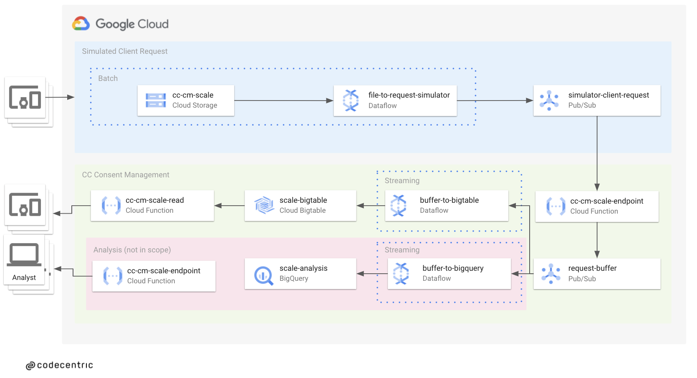
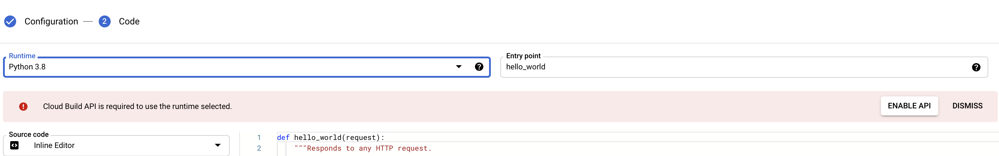

# How to create a Consent Management Platform Backend using Cloud Functions, PubSub and BigTable

In this hands-on tutorial, we will create a scalable backend handle thousands of requests per second for a consent management tool.
We follow the [Google Cloud reference architecture for AdTech](https://cloud.google.com/bigtable#section-9).

## Overview what we are going to build
### Architecture

Our infrastructure consists of 2 parts:

1. Backend to process the requests
2. Requests simulator

For the backend, we use
- serverless [Cloud Functions](https://cloud.google.com/functions)
- fully-managed real-time messaging service with [Pubsub](https://cloud.google.com/pubsub/docs)
- serverless stream processing with [Dataflow](https://cloud.google.com/dataflow)
- fully-managed NoSQL database [Bigtable](https://cloud.google.com/bigtable)

To evaluate and stress-test our application, we generate a requests simulator which can send 15k+ requests per second.

See here the overview of our infrastructure:



## Account Setup
The easiest way of building this uses-case yourself is by creating a dedicated project in the google cloud console for it. When you finished everything, you could just delete the projekt to avoid costs of ressources you no longer need. You should also have a look on the bottom of this README where the deletion-instuctions are located. To give a little assistance with the account & project setup we provide some informaiton about it in the [Account-Setup](./dev-friday-tasks/chapter-account-setup/GoogleAccountSetup.md) chapter.

## Google Cloud SDK setup
We recommend setting up the google cloud sdk for easier copy&paste functionality when following along.
To install and configure the sdk you can follow the official instructions or jump into the [CLI-Setup](dev-friday-tasks/chapter-cli-setup/GoogleCli.md) chapter we provided for that.

## Project Setup
After you have a functioning google SDK on your machine, export your project ID into an environment variable to reference it in the next upcoming steps.

```bash
export PROJECT_ID=<<YOUR_PROJECT_ID>>
```

## Enable the following APIs

With a ready to go sdk installation we need the following APIs to be enabled:

```shell
gcloud services enable bigtable.googleapis.com &&
gcloud services enable bigtableadmin.googleapis.com &&
gcloud services enable cloudbuild.googleapis.com &&
gcloud services enable clouddebugger.googleapis.com &&
gcloud services enable cloudfunctions.googleapis.com &&
gcloud services enable cloudresourcemanager.googleapis.com &&
gcloud services enable cloudtrace.googleapis.com &&
gcloud services enable containerregistry.googleapis.com &&
gcloud services enable dataflow.googleapis.com &&
gcloud services enable datastore.googleapis.com &&
gcloud services enable deploymentmanager.googleapis.com &&
gcloud services enable logging.googleapis.com &&
gcloud services enable monitoring.googleapis.com &&
gcloud services enable notebooks.googleapis.com &&
gcloud services enable pubsub.googleapis.com &&
gcloud services enable servicemanagement.googleapis.com &&
gcloud services enable serviceusage.googleapis.com &&
gcloud services enable stackdriver.googleapis.com &&
gcloud services enable storage-api.googleapis.com &&
gcloud services enable storage-component.googleapis.com &&
gcloud services enable storage.googleapis.com
```

## Create google cloud storage bucket

In this projekt we are using a storage bucket as our source to feed data into pubsub. Some [details of storage](dev-friday-tasks/chapter-storage-bucket/StorageBucket.md) buckets can be found in the dedicated chapter.

```bash
gsutil mb -p $PROJECT_ID -c STANDARD -l europe-west1 gs://${PROJECT_ID}-scale
```

---
**NOTE**

>If an error occurs e.g. `AccessDeniedException: 403 The project to be billed is associated with an absent billing account.`
Go to [gcp console](https://console.cloud.google.com) and make sure you are logged in with the correct accont.
Choose your project and configure your billing account!
---

## Copy example requests to your project

We put 2 million example (4 files with 500k each) requests in our publi bucket, you can copy them from there:

```bash
gsutil -m cp -r gs://cc-ml-dev-scale/messages gs://${PROJECT_ID}-scale/messages
```

They were generated using the request message generator script.

To generate your own messages, just generate request messages with this script:

* [Request message generator](dev-friday-tasks/request_message_generator/message_generator.py)

* [Usage and upload instructions](dev-friday-tasks/request_message_generator/README.md)

---

## Create PubSub Topic "simulator_client_request" (GUI)

We use google's pubsub as message-buffer and even as load-simulator in our project here. In this Step you need to create a topic identified by "simulator_client_request". You can find all necessary Info how to crate a topic in the specialised [PubSub](dev-friday-tasks/chapter-pubsub/PubSub.md) chapter

Or take the fast-lane and use the gcloud command:
````shell
gcloud pubsub topics create simulator_client_request
````

---

## Create PubSub Topic "request_buffer" (CLI)

As in the last step you have to create the second topic "request_buffer". If you need more info about creating topics refer to the [PubSub](dev-friday-tasks/chapter-pubsub/PubSub.md) chapter
````shell
gcloud pubsub topics create request_buffer
````

---

## Create Cloud Function "scale_endpoint" (GUI)

Now we "connect" the to pubsub topics with a Cloud function which sends data from the simulator-topic to receiver-topic. If you need help to create a cloud function here is some useful information about the creation of [cloud functions](./dev-friday-tasks/chapter-functions/GCFunction.md)

Set up the cloud function with the following:
- function_name: scale_endpoint
- region: europe-west1
- Trigger: Cloud Pub/Sub
- Cloud Pub/Sub topic: projects/<YOUR_PROJECT_ID>/topics/simulator_client_request
- Runtime: Python 3.9
- Entry point: publish_to_request_buffer

**Be aware that the 'Trigger' is of type pubsub topic simulator_client_request`.**
AND

**Make sure to set the `Entry point` to `publish_to_request_buffer`.**

The following code snippet is the necessary source code that can be copy&pasted into your newly created function. 
Take a look into line 8 to place your PROJECT_ID into the code. Furthermore switch to the reqirements.txt and copy&paste the contents under the python-snipped-code.

```python
# main.py
import base64
import json
import os

from google.cloud import pubsub_v1

# TODO(dev): Set your PROJECT_ID here
project_id = "<<PROJECT_ID>>"
topic_name = "request_buffer"

publisher = pubsub_v1.PublisherClient()

def publish_to_request_buffer(event, context):
    """Background Cloud Function to be triggered by Pub/Sub.
    Args:
         event (dict):  The dictionary with data specific to this type of
         event. The `data` field contains the PubsubMessage message. The
         `attributes` field will contain custom attributes if there are any.
         context (google.cloud.functions.Context): The Cloud Functions event
         metadata. The `event_id` field contains the Pub/Sub message ID. The
         `timestamp` field contains the publish time.
    """
    print(
        f"This Function was triggered by messageId {context.event_id} published at {context.timestamp}"
    )
    #print(event)
    #print(event.keys())
    data = event["data"]
    if data:
        print(f"raw data: {data}")
        # Base64 to JSON string
        message_str = base64.b64decode(data).decode('utf-8')
        # JSON string to dict
        message_dict = json.loads(message_str)
    else:
        raise Exception(f"No data in message {event['messageId']}")

    topic_path = publisher.topic_path(project_id, topic_name)

    # Retrieve message from data and add timestamp field
    message_dict["message_timestamp"] = context.timestamp
    message_json = json.dumps(message_dict)
    print(f"message_json {message_json}")
    message_bytes = message_json.encode('utf-8')

    try:
        publish_future = publisher.publish(topic_path, data=message_bytes)
        publish_future.result()  # Verify the publish succeeded
        return 'Message published.'
    except Exception as e:
        raise e
```

```
# requirements.txt
flask==1.1.2
google-cloud-error-reporting==1.1.1
google-cloud-pubsub==2.4.0
```

**Nice to know:**

- The [`PubsubMessage` format](https://cloud.google.com/pubsub/docs/reference/rest/v1/PubsubMessage)
has a key `data` which contains a base64 encoded string.
- Google Cloud Function metadata is a available via the [`context`](https://cloud.google.com/functions/docs/writing/background#functions_background_parameters-python).
- See here the [list of available environment variables inside the cloud function](https://cloud.google.com/functions/docs/env-var#nodejs_8_python_37_and_go_111).
- Google Cloud Functions can also be deployed with the [CLI](
https://cloud.google.com/sdk/gcloud/reference/functions/deploy).

---
**NOTE**

>If the cloud function api is not enabled, there is a warning.

Follow the steps and enable the cloud function api, or simply activate it via cli
`gcloud services enable cloudfunctions.googleapis.com` and `gcloud services enable cloudbuild.googleapis.com`
You can check available services with `gcloud services list --available`
---

## Create Bigtable Instance "scale-bigtable" with table and column family (CLI)

For those who would like to know what google's bigtable is, feel free to look into the [BigTable](dev-friday-tasks/chapter-big-table/BigTable.md) chapter.

In this step we create a big-table instance with the following cli commands:

Create bigtable instance ``scale-bigtable`` with SSD storage-type.
```
gcloud bigtable instances create scale-bigtable \
--cluster=scale-bigtable \
--cluster-zone=europe-west1-b \
--display-name=scale-bigtable \
--cluster-storage-type=SSD
```
The next big-table commands are issued with the cbt-tool of the google sdk. To use the cbt cli locally, run following commands for installing it:

```
gcloud components update
gcloud components install cbt
```
Finally some little configuration of the `cbt` utility

```
echo project = $PROJECT_ID > ~/.cbtrc
echo instance = scale-bigtable >> ~/.cbtrc
```
Next we need to crate a table and a column family to hold our data:

Create Table:

`cbt createtable scale-traffic`

Create a column family:

`cbt createfamily scale-traffic cf1`

**Optional** - Some nice to info about managing-tables with the cbt command:
- https://cloud.google.com/bigtable/docs/managing-tables

---
## Create notebook instance to deploy dataflow jobs

The fastest and less instrusive way for your system to create a dataflowjob is by using gcloud's jupyterlab-environment. Instructions to set it up can be found [here in the dataflow-chapter](./dev-friday-tasks/chapter-data-flow/Dataflow.md) with the headline 'Use gcloud's environment to deploy a dataflowjob'

## Create Dataflow Pipeline "buffer_to_bigtable" (Jupyter Notebook)

> If you are using dataflow for the first time, the corresponding API must be enabled!
> Here is the CLI-Version to do that:
```bash
gcloud services enable dataflow.googleapis.com
```

- **optional** - intro to [Apache Beam](dev-friday-tasks/chapter-data-flow/Dataflow.md)
- Here you can find the necessary code for the dataflow-job [dataflow-code](dev-friday-tasks/chapter-data-flow/buffer_to_bigtable.py)

There are different ways one can deploy a dataflow-job in gcloud. The fastest one is by using gloud's jypyterlab-environment (mentioned in the previous chapter). Nevertheless if you like tinkering around and get your hands dirty, we outlined two other ways setting up your develop-environment in the [dataflow chapter](dev-friday-tasks/chapter-data-flow/Dataflow.md).
We highly recommend to read it to understand the dataflow basiscs.

If you follow the **fast-lane**:
> - copy and paste the [dataflow-code](dev-friday-tasks/chapter-data-flow/buffer_to_bigtable.py) into a newly created notebook
> - change the project id in line 9 to yours
> - hit the play button above the notebook
> - check if dataflow-job is running in the dataflow-overview

---
## Create Cloud Function "ThirdPartyRequest" (CLI)
TODO: was this here an optional intent?

`gcloud functions deploy third_party_request --source=third_party_request.py --runtime=python39 --memory=128MB --trigger-topic=simulator_client_request #--stage-bucket`

---
## Create Dataflow pipeline "FileToRequestSimulator" (GUI, from Template)
Now things are getting interesting. Here we like to create a dataflow-job to feed the messages into our system. We will use a template which can be found in the dataflow-section with the button 'create job from template'. Use the following configs for the job:
>
>- Use DataflowTemplate - Text Files on Cloud Storage to Pub/Sub (batch one):
>  - Job name: FileToRequestSimulator
>   - Regional Endpoint: europe-west1 
>  - Input files: gs://\<your storage bucket>/messages/2million_messages/*.txt
>  - output topic: projects/\<your project id>/topics/simulator_client_request
>  - temp location: gs://\<your storage bucket>/dataflow/tmp

- **optional** - Nice to know:
  - Here you can find the source code to the [Templates](https://github.com/GoogleCloudPlatform/DataflowTemplates/tree/master/src/main/java/com/google/cloud/teleport/templates)
  - [more Info about running dataflow jobs](https://cloud.google.com/sdk/gcloud/reference/dataflow/jobs/run)

> Command for CLI for Templates:

>```
>gcloud dataflow jobs run simulate_requests --gcs-location gs://dataflow-templates-europe-west1/latest/GCS_Text_to_Cloud_PubSub --region europe-west1 --max-workers 15 --num-workers 1 --worker-region europe-west1 --staging-location gs://$PROJECT_ID-scale/temp --parameters inputFilePattern=gs://$PROJECT_ID-scale/messages/2million_messages/\*.txt,outputTopic=projects/$PROJECT_ID/topics/simulator_client_request
>```

---
# Look into metrics and bigtable
Finally you can use the ``cbt`` tool to look into the big-table:
```shell
cbt read scale-traffic
```
Here you can find some more information with the [cbt-tool](https://cloud.google.com/bigtable/docs/quickstart-cbt?hl=en)


---

# Optional

## Create Dataflow Pipeline "BufferToBigQuery"

... Try yourself! :-)

## Deletion (IMPORTANT!!!)

```bash
gcloud dataflow jobs cancel buffer-to-bigtable --region europe-west1 &&
gcloud functions delete scale_endpoint --region europe-west1 &&
gcloud pubsub topics delete simulator_client_request &&
gcloud pubsub topics delete request_buffer &&
gcloud compute instances delete scale-notebook && #may take very long
gcloud bigtable instances delete scale-bigtable &&
gsutil rm -r gs://$PROJECT_ID-scale
```
Some GCS buckets were autocreated! List them:

- `gsutil ls`

Then select your buckets to delete.

**Or you delete the entire project.**
