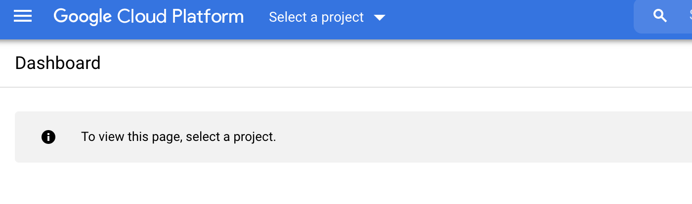
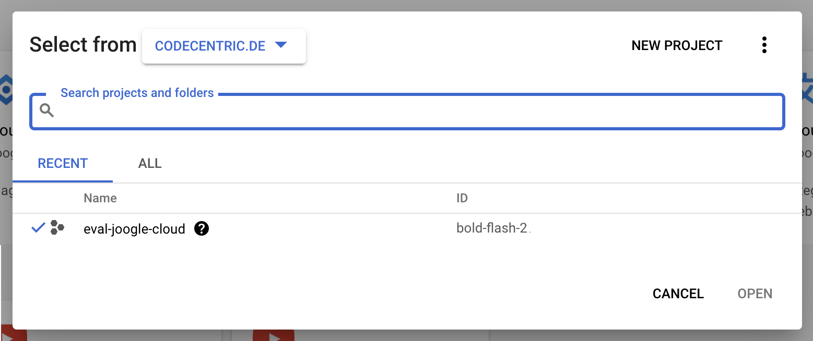
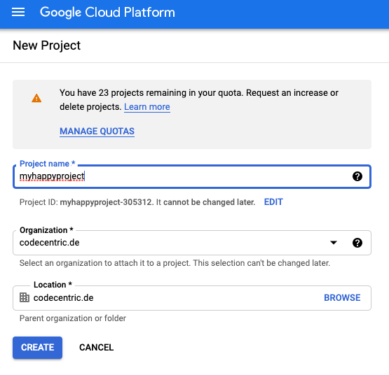
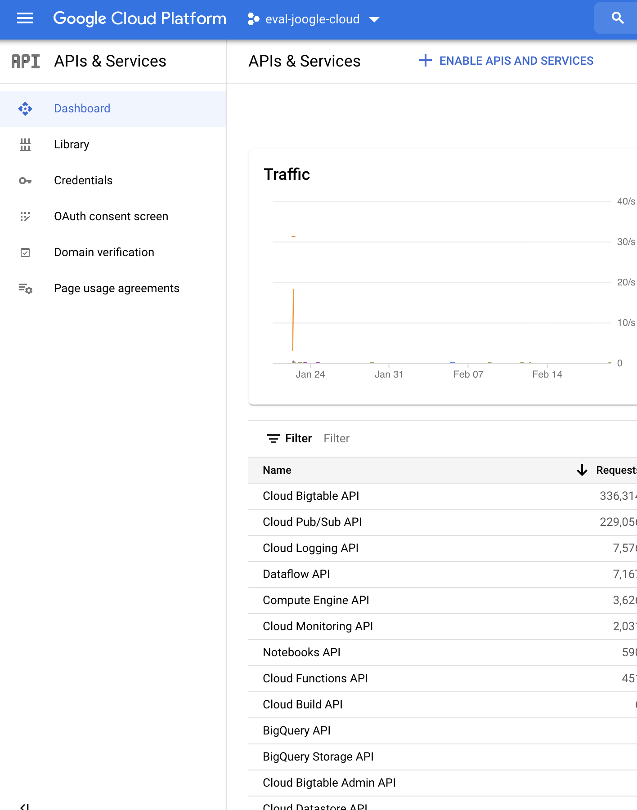

## Account Setup
Use your google-account and go to [cloud.google.com](https://cloud.google.com/) and use the button 'go-to-console'. Follow the Steps on the Site.

## Initialize Project
The First you see is an empty Dashboard, because you don't have any Project yet. To create one find 'select-project'

Here you will find all projects listed which you can access.

Just use the 'new project' button to get into the project create screen:

Choose a name and hit create and wait a minute to get your first Dashboard!

> If you create the project outside of codecentric. Just choose 'No Organization'

## API Access
When you like to use a cloud-service for the first time, you are asked to enable the api for that service. The api is used to monitor usage and costs of the service und manage the access to it.
Look for 'API & Services' to get an overview.

