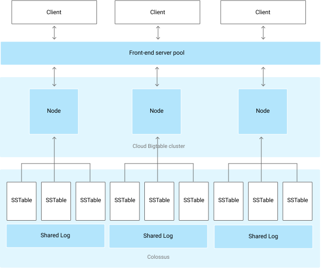

# BigTable

## What is BigTable?
Designed for indexing the web search, so the main requirements are performance, scale and strong consistency.

* NoSQL (no-join)  database and there is only 1 index - the row-key.
* Empty cells dont take space. 
* Updates either happen everywhere or don’t happen.


* Column family groups column-qualifiers
* Cell: CF:CQ - contains versions of the value with timestamp.
* Old versions are garbage collected at some point. 
* Write, modify and delete operations take extra space. 
* Delete is a modify operation with new empty value.

## Architecture



## Values of Cells and operations

### Supported data types

Cloud Bigtable treats all data as raw byte strings for most purposes. The only time Cloud Bigtable tries to determine the type is for increment operations, where the target must be a 64-bit integer encoded as an 8-byte big-endian value.

### Writing operations: 
* put 
* incerement
* append
* coditional updates
* bulk import

### Reading operations:
* gets
* range scan
* filter
* full scan
* export

### Schema Design
Example above isnt a good design, because the row has no specific horizon and could scale infinitly.

Solution: Field promotion:

rowKey: hashed_name_p1+hashed_namep2+ ... 

Overview of the BigTable design:


## Create BigTable

```
gcloud services enable bigtable.googleapis.com bigtableadmin.googleapis.com
```


