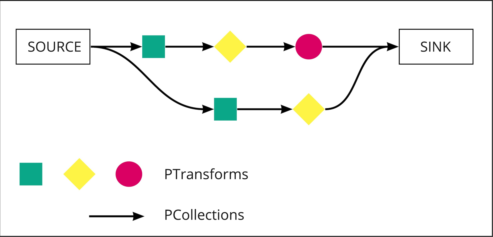
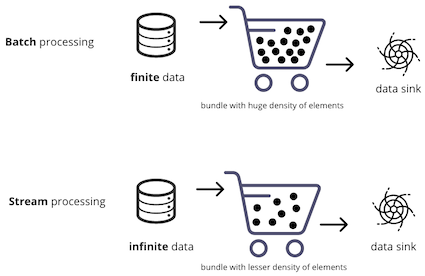
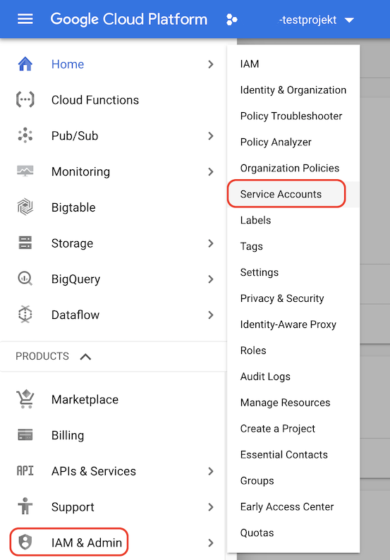
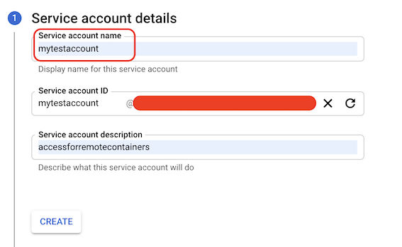
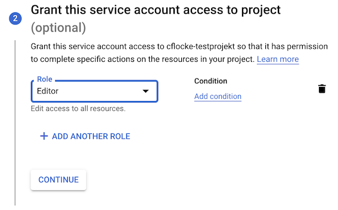
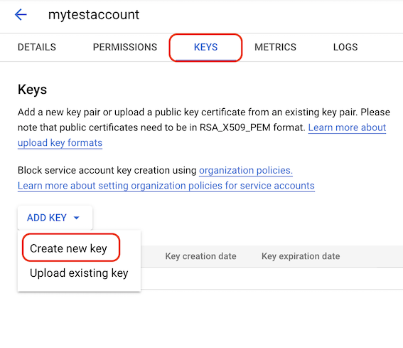
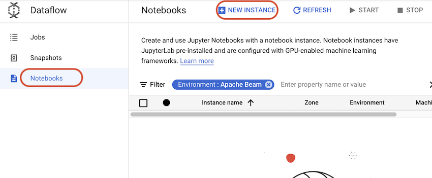
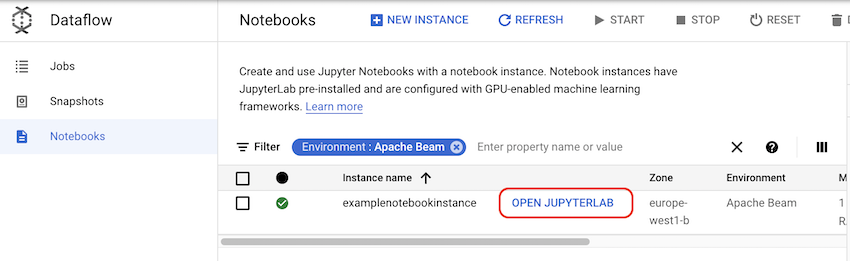
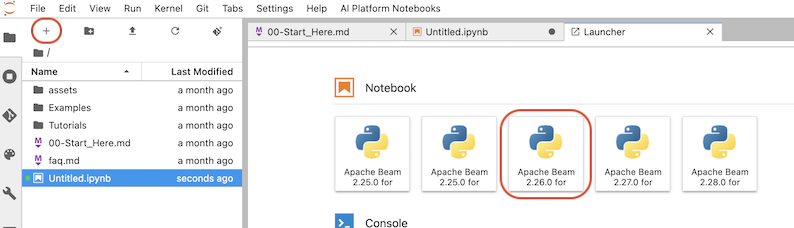
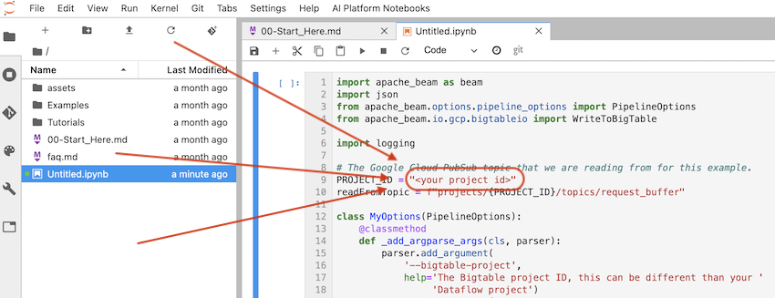

## What is this?
Google Dataflow let's you process huge streams of data in a parallel, autoscaling way. The Dataflow-Engine of Google-Cloud uses Apache Beam as an unified model for defining both batch and streaming data-parallel pipelines.
One could say apache beam acts as an abstraction-Layer on top of the underlying implementation for your preferred language. (e.g. pyhton or java). Apache Beam is a superset of the implementations for dataflow like apache flink, apache spark, apache samza or hazelcast jet.

## First was the Pipeline...
A pipeline can be described as an container, that holds all the processing-description-logic and rules for handling the data.
It can be split into three parts. It reads it's data from a source, which is then transformed in the second part of the pipeline. There can be as many transformations as you like in this part until you are satisfied that the processed data has the correct format. In the third and last step usually the data is written somewhere to a data sink.


## Transformers
The most interesting part is of course the second step of the pipeline. The transformation steps. This Part of the pipeline is simply put a concatenation of PCollections and PTransforms. If you go deeper and remember it is about parallel processing the one concatenation with several strands, could be named a directed graph from source to sink.



## PCollection & PTransform
Are both interfaces in apache beam. A PCollection defines a multi dataset, that can be distributed and in theory is infinite. The PTransform interface (ParDo == Parrallel Do) is one Step in a pipeline that modifies the elements in a PCollection. Therefore the input and output of a PTransform is a PCollection.
But to put your data somewhere, when all modification-steps are done, one can use a specailized version of a PTransform-> I/O Transforms can be used to read or write Data to external storage systems

// code example for step by step 

```python
Before running into code, examine the basic structure for creating a pipeline:

At the beginning, to define your pipeline, use p = beam.Pipeline().
The pipe | separates steps within the pipeline. Every time you want to add a new step, you need a new pipe.
At the right of the pipe, add the step you want to execute, | <STEP>. You can optionally name the step using >> between the step and the pipe | "NAME" >> <STEP>. Two steps cannot have the same name.
At the left of the pipe, there has to be a reference to a pipeline p | <STEP>, p | <STEP1> | <STEP2>... or squares | <STEP> (where squares is a pipeline variable ).

import logging

import apache_beam as beam
from apache_beam import Create, Map, ParDo, Flatten, Partition
from apache_beam import pvalue

p = beam.Pipeline()
N = 7
squares = (p | "Create Elements" >> Create(range(N))
           | "Squares" >> Map(lambda x: x**2)
           | Map(print))

p.run()
```
Further readings:
* [Apache Beam Programming Guide](https://beam.apache.org/documentation/programming-guide/#overview)
* [Apache Beam QuickStart](https://beam.apache.org/get-started/quickstart-py/)


## What's about Bundles and Batch vs. Streaming
As mentioned apache beam is best at processing large volumes of data in a parallel manner on multiple machines. Therefore it is not operating on all elements in a pipeline with all machines simultainiously. These elements get split into bundles of elements.
Dataflow knows to forms of operation with bundles depending what kind of data is going to be processed. The two processing modi are batch- and stream-processing. Choosing which one to use depends on your data source type. Batch processing is normally used for a finite data source like a file from a storage bucket. The streaming variant is used for an infinite data source.




>#### Bundles of data-elements
>Bundles are used to group together elements that are going to be processed. Each bundle is used to assign it to a worker for parallel processing. Depending on a batch or a stream processing, apache beam automatically puts more elements into a bundle for batch processing, than for a streamig operation. Things are getting interesting when an element ina bundle can not be processed. Then the worker has to calculate the whole bundle again. But it is not for sure that the retry of that failed bundle takes place on the same worker.

## Driver & Runner
Talking about drivers in dataflow, means the definition stage of a dataflow pipeline. Every file or step that is written as code can be looked at as a description on how to process the data. 
A Runner is the other part of executing the defined pipeline e.g. gcp dataflow or apache spark.

# Deploy a dataflowjob in glcoud
Here comes the fun part. In our example we are using python to define the dataflow-pipeline for our usecase. We experienced some difficulties setting up the local develop environment with the python variant.
The problem revolves around the pyarrow dependency of apache beam in python, which gets compiled during the installation of apache beam as a dependency in our python environment. To work around that issue (and because we love to play around with awesome tools) we see three ways of deploying a pipeline. 

The method of deploying a pipeline can be...
- ... using the develop-environment in gcloud itself (read on at chapter Use gcloud's environment to deploy a dataflowjob)
- ... using your local machine and cli (follow the next chapter)
- ... using docker with vs-remote-containers (skip the next chapter and read on)
- ... try everthing with the java-path of apache beam (not covered here. go to [apache-beam quickstart for java](https://beam.apache.org/get-started/quickstart-java/))

## Enable your Env to publish a dataflowjob from local CLI

>Requirements:
> - Python > 3.6
> - pip > 7.0.0
> - virtualenv > 13.1.0
> - working and authenticated gcloud sdk
> - enabled Dataflow and Storage-Bucket Apis
>
> The classic way to set up Apache-Beam can be found here [apache-beam quickstart for pyhton](https://beam.apache.org/get-started/quickstart-py/)

#### Classic Setup in a nutshell with python:
````python
# create new virtual environment
python3 -m venv ~/.virtualenvs/env
# activate it
. ~/.virtualenvs/env/bin/activate
# upgrade pip
pip install --upgrade pip
# upgrade setuptools
pip install --upgrade setuptools
# install apache-beam with googlecloud support
pip install apache-beam
````

## Enable your developmentenvironment with help of remote-containers in VS-Code
During the creation of this doc. I didn't get the local python-environment zu work on a big sur mac with x-code-selet cmake. The installation of apache-beam refused to compile the pyarrow-dependency of apache-beam. The error you should be looking at would look like:
ERROR: Failed building wheel for pyarrow

Working with apache-beam and python on the local machine is a crucial part to get things done, because a try-and-error loop during development only in the cloud environment is pretty slow. Therefore we are aming for a local debugging and coding solution which can be provided by the Microsoft-Plugin for VS-Code [Remote-Containers](https://code.visualstudio.com/docs/remote/containers).

>Requirements:
> - Win/Mac Docker Desktop 2.0+
> - Linux: Docker CE/EE 18.06+ and Docker Compose 1.21+
> - VS-Code - Remote-Containers

When everything is up and ready go to a preferred location and create a project-folder:
````shell
mkdir my_awesome_dataflow_project
cd my_awesome_dataflow_project
mkdir .devcontainer
cd .devcontainer
````
>Note: The files to be created can be found in this chapter in the folder [remote-containers-config](remote-containers-config)!

This folder has to hold two files for configuring the development-container:
The first one is named devcontainer.json :
````json5
//devcontainer.json - reference: https://github.com/microsoft/vscode-docs/blob/main/docs/remote/devcontainerjson-reference.md
{
  "name": "apache-beam sdk env",
  "build": {
    "dockerfile": "Dockerfile",
    "context": "..",
  },

  "settings": {
    "terminal.integrated.shell.linux": "/bin/bash",
    "python.pythonPath": "/usr/local/bin/python3",
    "python.linting.enabled": true,
    "python.linting.pylintEnabled": true,
  },

  "extensions": [
    "ms-python.python"
  ],
  // todo it automatically "initializeCommand": ["bash", ".devcontainer/auth_with_keyfile.sh"],
  "remoteUser": "vscode"
}
````
The second one is a Dockerfile based on a pre-build image from apache beam:
```dockerfile
FROM apache/beam_python3.7_sdk

# Use for authentication
#!!!!!!!!!!!!!!!!!!!!!!!!!!!!!!!!!!!!KEY-FILE-NAME-HERE!!!!!!!!!!!!!!!!!!!!!!!!!!!!!
#If you like to handle authentication by yourself just ignore this. For more information read the next paragraph Create a keyfile with a service-account
ENV GOOGLE_APPLICATION_CREDENTIALS=.devcontainer/<name-of-keyfile>.json
#!!!!!!!!!!!!!!!!!!!!!!!!!!!!!!!!!!!!KEY-FILE-NAME-HERE!!!!!!!!!!!!!!!!!!!!!!!!!!!!!

# Downloading gcloud package
RUN curl https://dl.google.com/dl/cloudsdk/release/google-cloud-sdk.tar.gz > /tmp/google-cloud-sdk.tar.gz

# Installing the gcloud package
RUN mkdir -p /usr/local/gcloud \
  && tar -C /usr/local/gcloud -xvf /tmp/google-cloud-sdk.tar.gz \
  && /usr/local/gcloud/google-cloud-sdk/install.sh --quiet

# Adding the package path to local
ENV PATH $PATH:/usr/local/gcloud/google-cloud-sdk/bin

# Install additional OS packages.
RUN apt-get update && export DEBIAN_FRONTEND=noninteractive \
    && apt-get -y install --no-install-recommends jq

# Use ${user} instead of root
ARG user=vscode
RUN useradd -ms /bin/bash ${user}
USER ${user}
```

## Create a keyfile with a service-account (optional)

This step is optional and is just for your convinience, to speed up the registration part of the gcloud-commandline utility in the docker container. You can do the authentication with the gcloud auth login --no-launch-browser command by yourself.
(Because you are working in a docker-container, when rebuilding it, you have to renew your authentication!)


First look for the IAM Topic in the side-menue and open the sub-entry Service-Accounts



Next create a new one and give it a name.



Then take into account what rights are necessary for your development actions. To keep it simple take the Basic -> Editor Option.
Of course, if you can follow the least privilige-Principal, just grant the rights you are realy going to need!



Before creating the service account one can give permission to users to modify the service account. Afterwards just press "Done" and go to the detail view of the freshliy created service-account.



Go to the "Keys"-tab and take the option "Create new key" in JSON-Format (in the popup). Once created an automatic Download of the keyfile is initiated. Keep the file save from others!

####What to do with that key-file
Reference the key-file by its path in the dockerfile. Copy it to the .devcontainer folder and put the filename in the docker file:

````dockerfile
FROM apache/beam_python3.7_sdk

# Use for authentication
#!!!!!!!!!!!!!!!!!!!!!!!!!!!!!!!!!!!!KEY-FILE-NAME-HERE!!!!!!!!!!!!!!!!!!!!!!!!!!!!!
ENV GOOGLE_APPLICATION_CREDENTIALS=.devcontainer/<name-of-keyfile>.json
#!!!!!!!!!!!!!!!!!!!!!!!!!!!!!!!!!!!!KEY-FILE-NAME-HERE!!!!!!!!!!!!!!!!!!!!!!!!!!!!!

# Downloading gcloud package
RUN curl https://dl.google.com/dl/cloudsdk/release/google-cloud-sdk.tar.gz > /tmp/google-cloud-sdk.tar.gz
...
````

For convinience this script should reside in the .devcontainer folder. (called auth_with_keyfile.sh)
```shell
#!/bin/bash
echo "Using keyfile path:"
echo $GOOGLE_APPLICATION_CREDENTIALS
if ! test -f "$GOOGLE_APPLICATION_CREDENTIALS"; then
    echo "Check the path to keyfile in dockerfile and rebuild the container"
    exit
fi
export CLIENT_EMAIL=$(jq -r ".client_email" $GOOGLE_APPLICATION_CREDENTIALS)
echo "read client email:"
echo $CLIENT_EMAIL
export PROJECT_ID=$(jq -r ".project_id" $GOOGLE_APPLICATION_CREDENTIALS)
echo "read project id:"
echo $PROJECT_ID
gcloud auth activate-service-account $CLIENT_EMAIL --key-file=$GOOGLE_APPLICATION_CREDENTIALS
gcloud config set project $PROJECT_ID
```

In the container's terminal just execute:
```shell
.devcontainer/auth_with_keyfile.sh
```
It should print something like
````shell
Activated service account credentials for: [xxx.iam.gserviceaccount.com]
Updated property [core/project].
````
>If you get an error like "Check the path to keyfile.." you haven't correctly referenced your keyfile in the Dockerfile. 
> 
Todo:

- document basic usage with local beam-wordcount-example
- let it run with everything else


## Deploy a Pipeline to Dataflow
A running pipeline job needs a temporary location to work with. Here we will use a storage bucket:
```
gsutil mb gs://${PROJECT_ID}-flow # create a storage-bucket
```
Using this Source-Code from [Github](https://github.com/apache/beam/blob/master/sdks/python/apache_beam/examples/wordcount.py) one can deplyo the pipeline by just executing it with python:
````python
python3 -m \
    apache_beam.examples.wordcount \
    --project $PROJECT_ID\
    --runner DataflowRunner \
    --temp_location \
    gs://${PROJECT_ID}-flow/temp \
    --output \
    gs://${PROJECT_ID}-flow/results/output \
    --job_name dataflow-intro \
    --region europe-west1
````
> * project is the GCP project.
> * runner is the specific execution engine to use to run your pipeline. The DataflowRunner uses the Dataflow Service as the execution engine.
> * temp_location is the storage bucket Cloud Dataflow will use for the binaries and other data for running your pipeline. This location can be shared across multiple jobs.
> * output is the bucket used by the WordCount example to store the job results.
> * job_name is a user-given unique identifier. Only one job may execute with the same name.
> * region specifies a regional endpoint for deploying your Dataflow jobs.

# Use gcloud's environment to deploy a dataflowjob
The fastes way for setting up a python deployment environment is to use jupiter-notebooks in gcloud. Find the dataflow-section in the left side menue and choose the notebooks-entry



Create a new instance with:
>- name: scale-notebook
>- region: europe-west1
>- zone: europe-west1-b
>- environment: Apache Beam
>- machine type: n1-standard-1

leave all other settings at their defaults.

Wait until the instance is created. You will see a spinner next to the column of the instance name. When it's ready a link will appear saying 'Open Jupyterlab'.



Gcloud spins up a compute engine instance, equiped with all necessary development components for apache-beam and a jupiterlab environment.
###!!!IMPORTANT!!!
This instance is only used for development purposes. After your apache-beam job is running and deployed, this instance is not used anymore and can be shutdown to safe costs.

By clicking the open-jupiterlab-link a new tab will open and reveal the lab environment. Create a new notebook by clicking on the plus symbol in the upper left and choose 'Apache Beam 2.26.0'.



Take the contents of buffer_to_bigtable.py and paste it into the notebook-cell. Turn on linenumbers find the 'View'-Entry and choose 'Show Line Numbers'.
Go To line 9 and replace <your project id> with the id of your project!



When everything is set-up one can start the code by hitting the Play-symbol or ctrl + return. The two [] will indicate with an * that the code is executed.
Looking into the Dataflow-Jobs-Section of glcoud-console there should pop up an entry with your desired job.


### Background
When working from you local machine, you have to create a template from the dataflow-job's source and put it on a storage-bucket location. Afterwards it is possible to execute this template via cli.
To take a closer look:
* [Creating and Staging Templates](https://cloud.google.com/dataflow/docs/guides/templates/creating-templates#creating-and-staging-templates)
* [Running Templates](https://cloud.google.com/dataflow/docs/guides/templates/running-templates)

