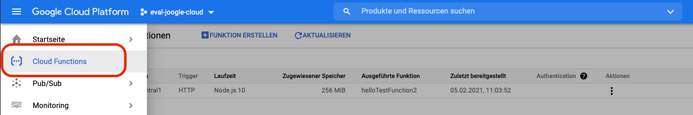
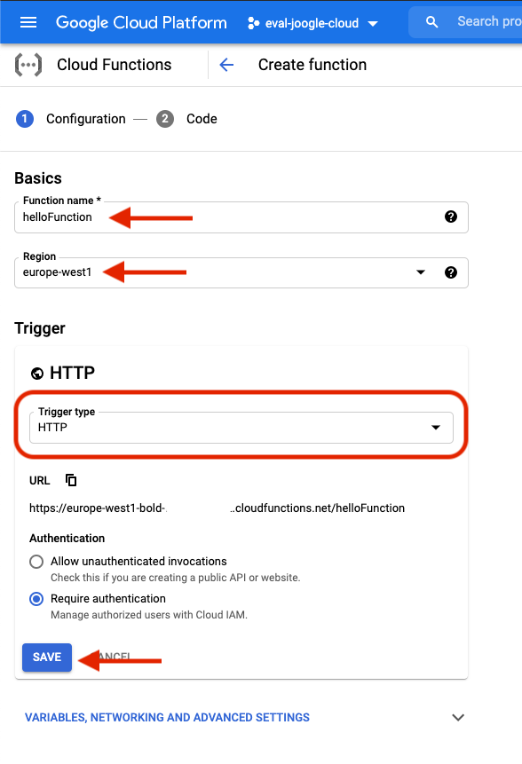
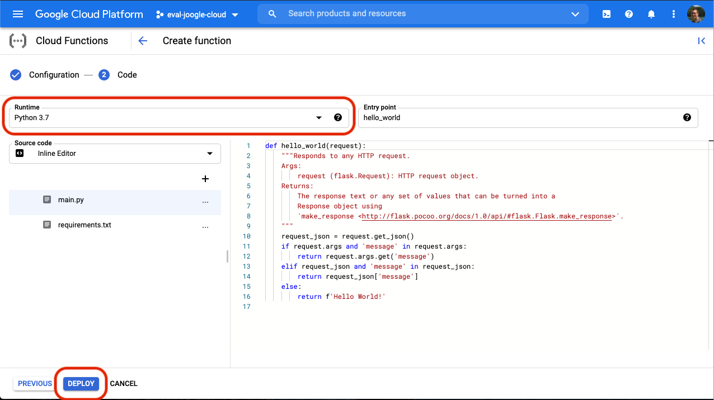
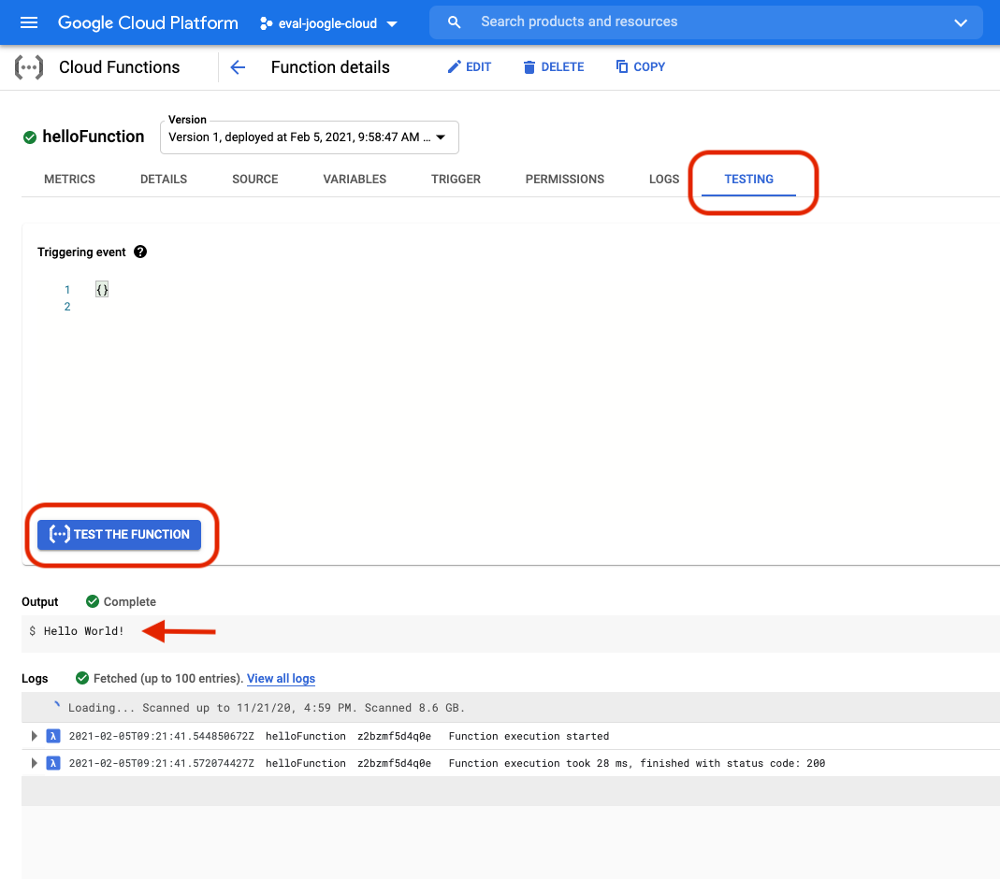
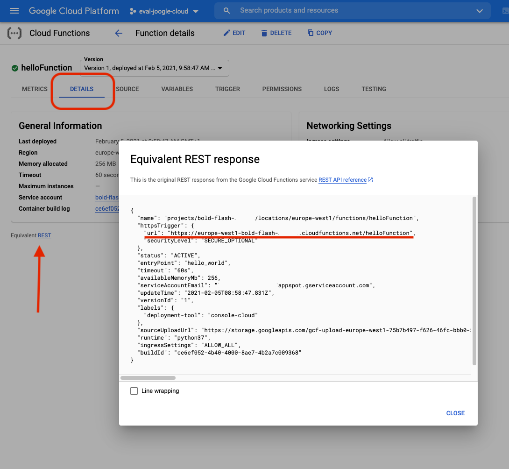

There are two ways you can create a function in GC (Google Cloud). Let's take the 'Klicki-Bunti'-Approach first and search in the left side or in the search-box on top for cloud functions. 

 

> Note:  If you are using google cloud services you are asked to enable the corresponding apis. Just press the 'Enable Api-Button'

Choose the Button for creating a function. Next, enter a function name e.g. 'helloFunction' and choose europe-west1 (belgium) for the region (more or less the lowest costs).

A Function can be triggered via various events. This time leave or choose the HTTP Trigger-Type.



Hit save and next where you are presented by choosing your preferred runtime for the function. For now choose 'Python 3.7' and hit deploy. 

The next screen will present the creation of the function, this could take a few moments.

The fucntion comes with a Hello-World-example build in. To test it in the the browser go to details and on the testing tab.  



Hit 'Test the function'-Button and you should see a charming "Hello World" in the output area below.

To test it via local command line go to the function's details on the details tab. By clicking the link "Equivalent REST" you can copy the endpoint for the function. 



Just call it with curl and an authorization bearer header. The bearer token can be generated with the command 
```
gcloud auth print-identity-token 
```

```
e.g. curl https://europe-west1-bold-flash-298312.cloudfunctions.net/helloFunction -H "Authorization: bearer $(gcloud auth print-identity-token)"
```

## create a function with gcloud cmd

* Navigate to you local project
* Create a new folder in you project and add a new file for your new function. The following runtimes are supported: 
  * nodejs10: Node.js 10
  * nodejs12: Node.js 12
  * nodejs14: Node.js 14
  * python37: Python 3.7
  * python38: Python 3.8
  * python39: Python 3.9
  * go111: Go 1.11
  * go113: Go 1.13
  * java11: Java 11
  * dotnet3: .NET Framework 3
  * ruby26: Ruby 2.6
  * nodejs6: Node.js 6 (deprecated)
  * nodejs8: Node.js 8 (deprecated)
  
Example function with node.js

```
exports.helloWorldTest = (req, res) => {
  res.send("Hello World!");
};
```

* deploy the cloud function

```
gcloud functions deploy helloWorldTest --runtime nodejs10 --trigger-http --allow-unauthenticated
```
