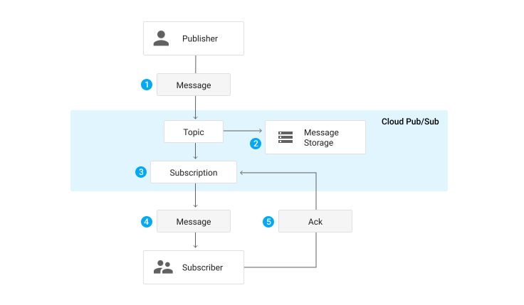
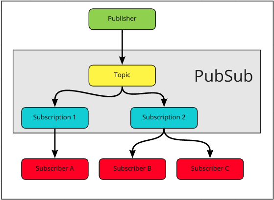
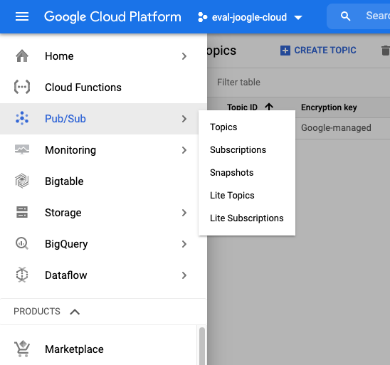
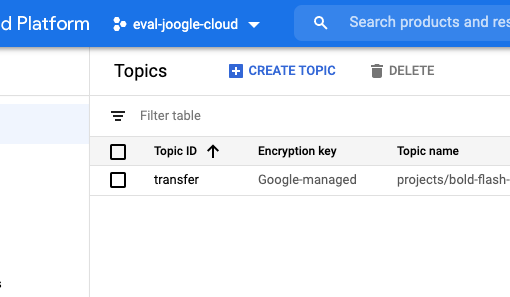
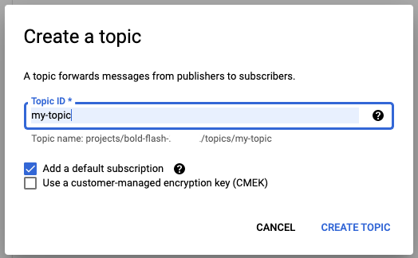

# PubSub the google's-Kafka
Overview of all components in a Pub/Sub system


* Messages from a publisher can contain optional attributes to describe the payload.
* Messages are retained until they get acknowledged by a subscriber that consumed the message.
* Each Subscription gets a message forwarded individually
* Messages can be pulled in by the subscriber or pushed by pubsub to the subscriber.
* Acknowledged messages are removed from the subscription's message que

> Note: PubSub lets you handle asynchronos messages in you cloud project. A big difference to Kafka are acknowledged messages from a subscriber. There can be multiple subscribers for one topic. A subscriber has to acknowledge the reception of messages. When PubSub recieves the acknowledgement for messages these are not distributed to other subscribers that are also listining to the topic.

Imagine the following:



In this Situation you have two subscribers for one subscription. In this case  PubSub will not deliver the same messages to both subscribers (B&C). The messages that B recieves and acknowledged can't be recived by C!

## Create PubSub Topic 

Find PubSub and the topic overview in the left side menue.



Choose 'create topic'



and give it an unique name.



> Note: When you are typing the name of the topic the window shows under which name it can be accessed later on. e.g. projects/\<yourprojectid\>/topics/\<yourtopicname\>

## Create Topic via commandline

* To create a Topic
```
gcloud pubsub topics create TOPIC_ID
```

* To delete a Topic 
```
gcloud pubsub topics delete TOPIC_ID
```

* To list Topics 
```
gcloud pubsub topics list
```
