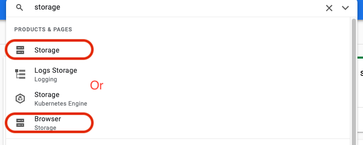
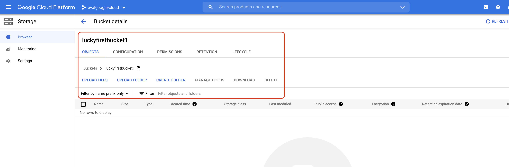
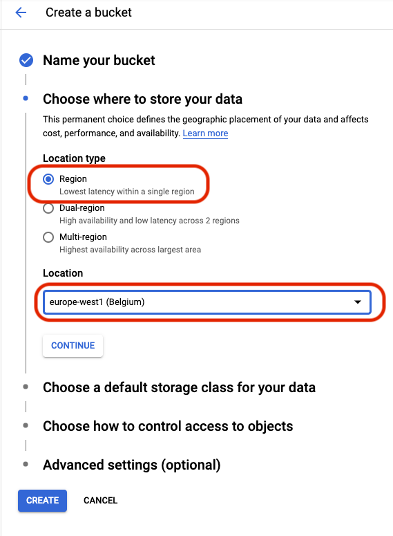
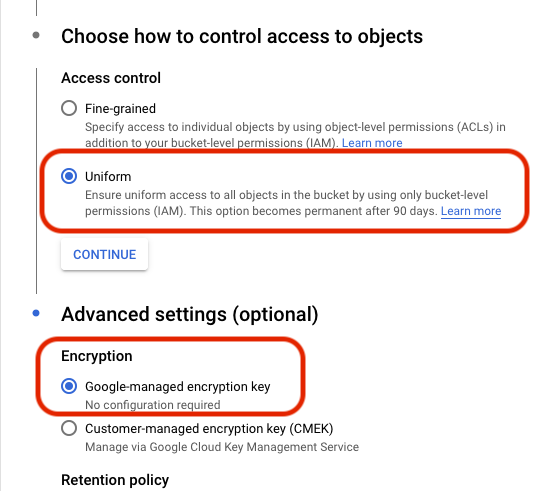

## Create a storage bucket the UI-way
Open the cloud storage browser. You can find it by searching for 'Storage' in the search bar or find it in the left side menue. 


Generate a new bucket by clicking the button 'create bucket' and choose a unique name for it. 

 Next you can choose what location type the bucket should be. This time use 'Region' and for Location choose 'europe-west1'.



The next step relates to the kind of data you plan to store in that bucket. For now take the standard option and see what other categories are available. Afterwards continue with the 'Uniform' access control setting and let google handle the encryption.

 Press 'create' to build the bucket and see it in your Storage Browser.


## Create a storage bucket via commandline

```
  gsutil mb -p PROJECT_ID -c STORAGE_CLASS -l BUCKET_LOCATION -b on gs://BUCKET_NAME
```

* -p look for your project id on the projekt overview 

or use
```
gcloud projects list
```
* -c available storage classes:
  * STANDARD
  * NEARLINE
  * COLDLINE
  * ARCHIVE

* -l a location overview is avaliable [here](https://cloud.google.com/storage/docs/locations?hl=en)

* -b use IAM as access control system
> Note: IAM enables you to grant access control on project and bucket level. Access Control Lists (ACLs) are used to administrate permissions on object level the bucket contains.

* gs://BUCKET_NAME - name must be lower case and can take up between 3 and 63 characters
